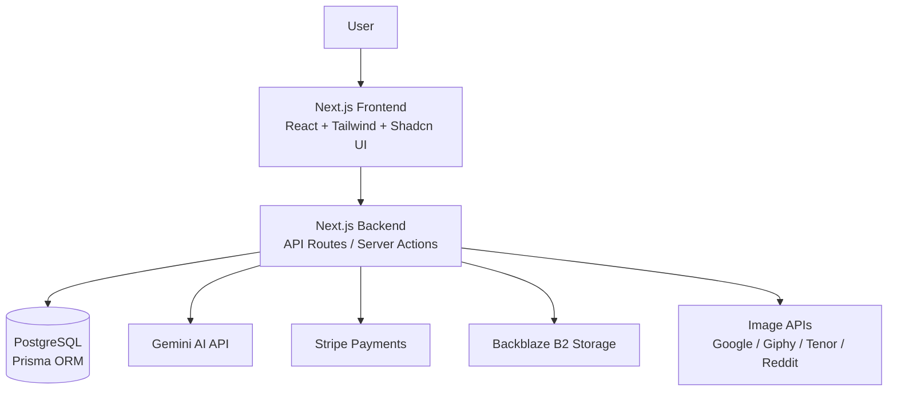
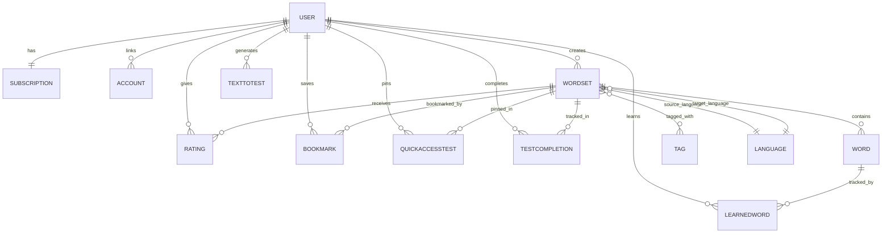

# System Design

## 1. Overview

FliSpark is a SaaS platform for language learning that focuses on interactive testing and content generation.

Users can:

- create tests manually or from text (Text-to-Test feature)
- learn using different modes (Multiple Choice, True/False, Active Recall, Audio)
- track their progress through test attempts
- create dictionaries in which words will be automatically translated on the platform
- automatically creates a context in which new words are used

The system is designed as a fullstack web application with a focus on fast iteration and scalability for future growth.

## 2. Architecture

The application follows a monolithic fullstack architecture using Next.js.

### Main components:

- Frontend (Next.js / React)
- Backend API (Next.js API routes / server actions)
- Database (PostgreSQL via Prisma)
- External services:
    - Authentication provider (NextAuth or similar)
    - Saving pictures (Backblaze B2)
    - AI/Text processing service (Google Gemini Flash)
    - Payment (Stripe)
    - User email confirmation (Nodemailer)

### High-level flow

User interacts with the UI → request is sent to the backend → data is processed and stored → response is returned → UI updates accordingly.

## Architecture Diagram

## 3. Tech Stack

- **Next.js (App Router)**  
  Fullstack framework for building both frontend and backend logic in a single project.

- **TypeScript**  
  Strongly typed programming language for safer and more maintainable code.

- **Tailwind CSS**  
  Utility-first CSS framework for rapid UI development.

- **Prisma**  
  Type-safe ORM for database access and schema management.

- **PostgreSQL**  
  Relational database used for storing structured data (users, tests, questions, etc.).

- **Google Gemini API**  
  AI model used for generating translations, contextual explanations, and test creation.

- **Backblaze B2**  
  Cloud storage for user-uploaded images and media files.

- **Stripe**  
  Payment processing platform for handling subscriptions and payments.

## 4. Data Flow

### Example: Creating a Word Set

1. The user submits the word set creation form.
2. The client performs basic validation (required fields, format).
3. An asynchronous request is sent to the backend API.
4. The backend:
    - Validates the payload (schema validation, auth check)
    - Persists the data to the database
5. The server returns a response with the created entity.
6. The client updates the UI state (e.g., cache or global state), and the new word set appears in the list.

### Example: Adding Words (Async + AI Processing)

1. The user inputs a new word in the word set page.
2. When interacting with the input (e.g., moving to the next field), a request is sent to the backend.
3. The backend:
    - Validates and sanitizes the input
    - The backend sends a request to the Google Gemini API
4. The AI service returns translation results.
5. The backend:
    - Processes and normalizes the response
    - Associates translations with the word
6. The server returns the updated list of words data to the client.
7. The client updates the UI, displaying the list of available translations.

### Example: Creating a Text-to-Test

1. The user navigates to the /text-to-test page and enters arbitrary text into a textarea input.
2. The client performs lightweight validation (e.g., non-empty input, length constraints).
3. An asynchronous request is sent to the backend to extract translations and synonyms for the provided text.
4. The backend sends a request to the Google Gemini API to process the text and generate translations.
5. The backend:
    - Parses and formats the response
    - Structures the data into normalized word entries
6. The processed data is returned to the client.
7. The client:
    - Maps original words to their translated equivalents
    - Constructs word pairs for further use (e.g., learning or testing)
8. The UI displays the generated list of words and translations.
9. The user can optionally:
    - Send a request to the backend to filter out words already learned (based on existing data in the database)
    - Remove or exclude specific entries from the list
10. Once the list is finalized, the user can create a test:
    - A request is sent to the backend
    - The test is persisted in the database and becomes available for the learning flow

## 5. Database Design (High-Level)

### Core Entities

- **User**
    - Stores user profile, authentication data, and credits (diamonds)
    - Has one subscription
    - Owns multiple word sets and learning data

- **WordSet**
    - A collection of words created by a user
    - Supports public/private visibility
    - Can be cloned from another word set
    - Connected to languages, tags, ratings, and words

- **Word**
    - Represents a single vocabulary item
    - Contains original word, translation, and optional media (image/audio)
    - Belongs to a WordSet

- **TextToTest**
    - Stores generated word lists from free-form text input
    - Used for dynamic test creation

### Supporting Entities

- **Subscription**
    - Manages user billing and Stripe subscription status
    - One-to-one relationship with User

- **Language**
    - Defines supported languages
    - Used as source and target for WordSets

- **Tag**
    - Categorizes WordSets
    - Many-to-many relationship with WordSet

- **Rating**
    - Stores user ratings for WordSets
    - One rating per user per WordSet

### Learning & Progress Tracking

- **LearnedWord**
    - Tracks words learned by a user
    - Many-to-many between User and Word

- **TestCompletion**
    - Tracks how many times a user completed a test

- **QuickAccessTest**
    - Stores pinned tests for quick access

- **Bookmark**
    - Allows users to save WordSets

### Authentication & System

- **Account**
    - OAuth provider accounts (Google, etc.)

- **VerificationToken**
    - Email verification and password setup

- **WebhookEvent**
    - Stores Stripe webhook events (idempotency layer)

## Relationships Overview

- User → WordSet (1:N)
- WordSet → Word (1:N)
- User → Subscription (1:1)
- User ↔ Word (M:N via LearnedWord)
- User ↔ WordSet (M:N via Bookmark, Rating, QuickAccessTest)
- WordSet ↔ Tag (M:N)
- WordSet → Language (source & target)
- WordSet → WordSet (self-relation for cloning)

## Diagram

## 6. API Design (High-Level)

### Word Sets

- POST /wordsets → create word set
- GET /wordsets → fetch user word sets
- GET /wordsets/:id → get word set details

### Words

- POST /wordsets/:id/words → add word
- DELETE /words/:id → remove word

### Text-to-Test (AI Flow)

- POST /gemini/text-to-test → generate word list from text (AI-powered)

### Learning

- POST /learned-words → mark word as learned
- GET /learned-words → fetch user progress

### Tests

- POST /tests → create test
- GET /tests/:id → get test details

## 7. Scalability Considerations

(Currently basic, but designed for future scaling)

- AI processing (Text-to-Test) is handled asynchronously to avoid blocking user requests.
- Word and test data is stored in a relational database with normalized relations for consistency.
- Learn progress tracking is separated from core content to reduce write contention.
- Stripe webhooks are processed independently to ensure payment reliability.
- Frequently accessed data (word sets, tests) can be cached to reduce database load.
- System is designed to support horizontal scaling of the backend API layer.

## 8. Security

- Authentication is handled via secure session-based / OAuth flows.
- Sensitive data (e.g. passwords) is hashed and never stored in plain text.
- API routes are protected and validated on the backend.
- User-specific resources (word sets, tests, progress) are scoped by user ID to prevent unauthorized access.
- Stripe webhooks are verified to prevent fake payment events.
- Input data is validated and sanitized before processing (including AI requests).

## 10. Trade-offs & Decisions

- AI processing (Text-to-Test and translations) is handled on the backend instead of the frontend to ensure security, consistency, and control over external API usage.
- Text-to-Test generation is executed asynchronously via API calls rather than blocking the UI, improving perceived performance and user experience.
- Learned words are stored in a separate entity instead of being embedded in Word or WordSet to decouple user progress from core content and allow flexible learning analytics.
- WordSet cloning was chosen instead of copying full datasets to reduce data duplication and keep relationships between original and derived content.
- A relational database was chosen over NoSQL to ensure strong consistency between users, word sets, words, and learning progress.
- AI-generated translations are processed on the backend rather than stored directly from the AI response to allow normalization, filtering, and future extensibility.
- Test creation is separated from Text-to-Test generation to keep content generation and learning workflows independent.
- User learning progress (LearnedWord, TestCompletion) is tracked separately from WordSet data to avoid coupling learning state with content structure.
- Stripe payments are handled via webhook events to ensure reliable and idempotent subscription state updates.

## 11. Future Improvements

- Browser extension for quickly adding words directly to word sets from any webpage.
- UI/UX redesign with improved consistency and modern interface patterns.
- Enhanced analytics for tracking learning progress and user performance.
- Mobile application version for iOS and Android.
- Ability to save favorite words and focus learning only on selected items.
- Dedicated mobile app experience optimized for learning on the go.
