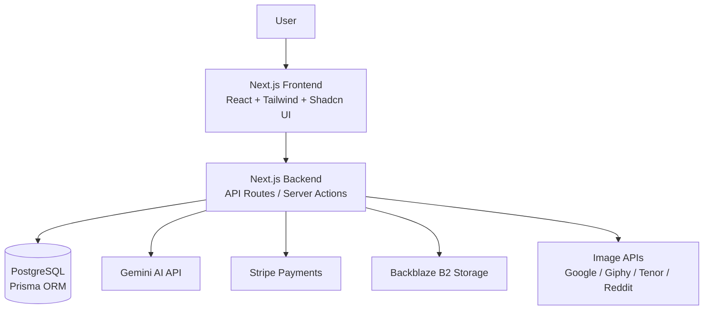

# System Design

## 1. Overview

FliSpark is a SaaS platform for language learning that focuses on interactive testing and content generation.

Users can:

- create tests manually or from text (Text-to-Test feature)
- learn using different modes (Multiple Choice, True/False, Active Recall, Audio)
- track their progress through test attempts
- create dictionaries in which words will be automatically translated on the platform
- automatically creates a context in which new words are used

The system is designed as a fullstack web application with a focus on fast iteration and scalability for future growth.

---

## 2. Architecture

The application follows a monolithic fullstack architecture using Next.js.

### Main components:

- Frontend (Next.js / React)
- Backend API (Next.js API routes / server actions)
- Database (PostgreSQL via Prisma)
- External services:
    - Authentication provider (NextAuth or similar)
    - File upload (UploadThing)
    - Saving pictures (Backblaze B2)
    - AI/Text processing service (Google Gemini Flash)
    - Payment (Stripe)
    - User email confirmation (Nodemailer)

### High-level flow

User interacts with the UI → request is sent to the backend → data is processed and stored → response is returned → UI updates accordingly.

## Architecture Diagram

---

## 3. Tech Stack

- **Next.js (App Router)**  
  Fullstack framework for building both frontend and backend logic in one project.

- **React**  
  UI library for building interactive interfaces.

- **Prisma**  
  Type-safe ORM for working with the database.

- **PostgreSQL**  
  Relational database for structured data (users, tests, questions).

- **Tailwind CSS**  
  Utility-first CSS for fast UI development.

- **UploadThing**  
  Used for handling file uploads (e.g. images, audio).

---

## 4. Data Flow

### Example: Creating a test

1. User submits form (frontend)
2. Request is sent to API
3. Backend validates input
4. Data is saved to database
5. Response is returned to UI

### Example: Passing a test

1. User starts test
2. Questions are fetched from API
3. User submits answers
4. Backend evaluates results
5. Attempt is stored in database

---

## 5. Database Design

### Main entities:

- **User**
    - id
    - email
    - name

- **Test**
    - id
    - title
    - userId

- **Question**
    - id
    - type (multiple_choice, true_false, etc.)
    - content
    - testId

- **Attempt**
    - id
    - userId
    - testId
    - score

### Relationships:

- User → Tests (1:N)
- Test → Questions (1:N)
- User → Attempts (1:N)
- Test → Attempts (1:N)

---

## 6. API Design

Example endpoints:

- `POST /api/tests`  
  Create a new test

- `GET /api/tests/:id`  
  Get test by id

- `POST /api/attempts`  
  Submit test attempt

- `GET /api/attempts`  
  Get user attempts

---

## 7. Key Features Design

### 7.1 Text-to-Test

Allows users to generate tests from raw text input.

Flow:

1. User provides text
2. System processes text
3. Questions are generated automatically
4. User can edit and save the test

Key challenge:

- parsing text and generating meaningful questions

---

### 7.2 Learning System

Supports multiple learning modes:

- **Multiple Choice**
- **True/False**
- **Active Recall** (user types the answer)
- **Audio Test** (user listens and types the answer)

Each mode uses different validation logic and UI interaction.

---

## 8. Scalability Considerations

(Currently basic, but designed for future scaling)

- Pagination for large datasets (tests, attempts)
- Separation of concerns between frontend and backend
- Potential future improvements:
    - caching (Redis)
    - CDN for static assets
    - background jobs for heavy processing

---

## 9. Security

- Authentication (NextAuth / JWT)
- Input validation on backend
- Protection against:
    - XSS
    - CSRF
- Rate limiting (planned)

---

## 10. Trade-offs & Decisions

- **Monolith vs Microservices**  
  Chosen monolith for faster development and simplicity.

- **Prisma vs raw SQL**  
  Prisma provides type safety and faster development.

- **Next.js fullstack approach**  
  Reduces complexity by keeping frontend and backend in one codebase.

---

## 11. Future Improvements

- AI-powered question generation
- Spaced repetition system
- Better analytics for learning progress
- Mobile app version
